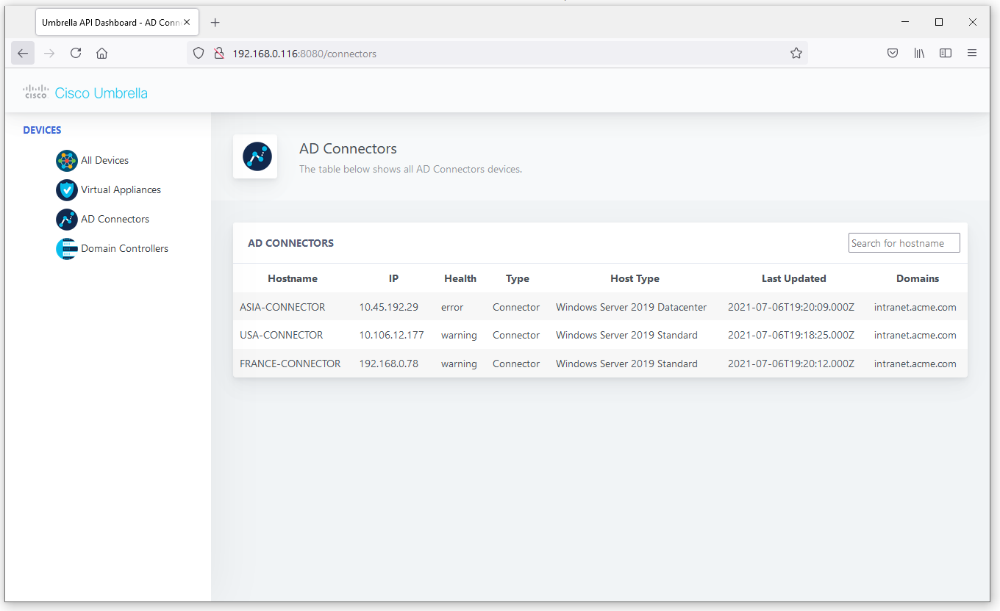
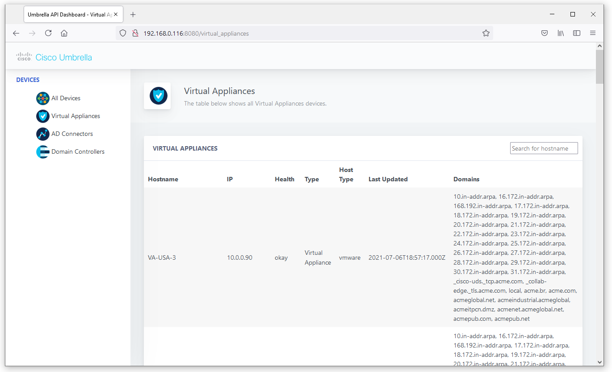

# Umbrella API Dashboard
This is the Umbrella API Dashboard source code. Using Umbrella API's, we can obtain information about our Devices that are currently not being displayed on the dashboard.

The initial scope of this Dashboard is to provide quick information such as when was a Virtual Appliance last synched with the Cisco Dashboard and what are the current Internal Domains for this element. This information is crucial to troubleshooting situations where new domains were added but they take some time to synch with all Virtual Appliances. 

[](https://developer.cisco.com/codeexchange/github/repo/RenanHingel/Umbrella-API-Dashboard)

## Contacts

* Renan Hingel (renanhingel@gmail.com)

## Solution Components
* Cisco Umbrella API
* Python
* Flask
* JavaScript

## Installation:

#### Clone the repo
```console
git clone https://github.com/RenanHingel/Umbrella-API-Dashboard.git
```

### Python

#### Set up a Python venv
First make sure that you have Python 3 installed on your machine. We will then be using venv to create
an isolated environment with only the necessary packages.

##### Install virtualenv via pip
```
pip install virtualenv
```

##### Create a new venv
```
# Change to your project folder
cd umbrella-scheduler

# Create the venv
virtualenv venv

# Activate your venv
source venv/bin/activate
```

#### Install dependencies
```zsh
pip3 install -r requirements.txt
```


## Setup:
You can deploy this prototype in a lab environment, dCloud instance, or on your own deployment.


#### Umbrella details:
You need to have your Management API Key, API Secret, and Organization ID.

To generate an API KEY, refer to the documentation [here](https://docs.umbrella.com/umbrella-api/docs/authentication-and-errors).

You must select an organization to manage and use its ORGANIZATION ID. You may do so
[here](https://docs.umbrella.com/deployment-umbrella/docs/find-your-organization-id).

Fill in the details of your Umbrella deployment in the [DETAILS.py](controller/details.py) file. 
```
################################################################
org_id = "XXXXXX"
api_key = "YYYYYYYYYYYYYYYYYYYYYYYYYYYYYYYYYYY"
api_secret = "ZZZZZZZZZZZZZZZZZZZZZZZZZZZZZZZZZ"
################################################################
```

## Usage:

### Python
Launch the app.py server. Make sure that you have your venv activated.
```commandline
flask run --host=0.0.0.0 --port=8080
```

### Running
Launch your web browser and navigate to [localhost:5100](localhost:5100) or with your configured port.

### AD Connectors


### Virtual Appliances screen



## Links to DevNet Learning Labs
For more resources on Umbrella API's and containers you may refer to the following learning labs:
* [Umbrella](https://developer.cisco.com/learning/modules/umbrella-v11)

## Other info:
I'm developing this project to improve my Python + Flask skills, I am sure this can be improved a LOT if you have Python/Flask skills, feel free to improve upon this source code.

## License
This source code is not currently under any license type, it will be submitted to Cisco DevNet.

The web template design was provided by DashboardPack (https://dashboardpack.com). I did some minor adjustments to adapt their template to what I needed for this project.
